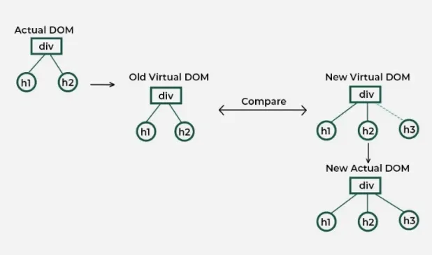

# 24th January

Source: https://app.notion.com/p/2ed1199ccfe3806da31bee7cc80c8e36


## What is rendering ?

**Rendering** is the process where React **runs your component function (or ****`render`**** method)** to determine **what the UI should look like for the current state and props**, producing a **Virtual DOM tree**.

FYI:

> Rendering does not mean updating the browser DOM — it only means computing the UI description.


```javascript
State / Props change
        ↓
Render phase
(component function runs)
        ↓
New Virtual DOM created
        ↓
Diff with old Virtual DOM
        ↓
Changes found?
   ├─ No → stop
   └─ Yes → commit phase
                 ↓
           Update real DOM
```

- Rendering **does not update the real DOM**

- Rendering only produces a **UI description** (Virtual DOM)

- That description is later used to decide DOM updates


## What is a virtual DOM ?

**Common definition: **

“Virtual DOM is an in-memory representation of the real DOM”


**My definition: **

A **pure JavaScript object tree** that describes **what the UI should look like**, independent of the browser.

### What Virtual DOM is NOT

Virtual DOM is **not**:

- A copy of the real DOM

- A browser structure

- Something with layout or styles computed

- Something the browser understands

The browser never sees Virtual DOM.


### Concrete example

JSX:

```javascript
<h1 className="title">Hello</h1>
```

Virtual DOM (conceptually):

```javascript
{
	type:"h1",
	props: {
		className:"title",
		children:"Hello"
  }
}
```

This is just **data**.

**No width.**

**No height.**

**No pixels.**

**No layout.**


### **Why “representation of real DOM” is misleading**

Because:

- Virtual DOM can exist **without any real DOM**
  - Server rendering
  - React Native

- Virtual DOM may describe UI that **never gets rendered**

- It’s possible to render Virtual DOM multiple times without touching real DOM


So it’s better to say:

> Virtual DOM represents intended UI, not actual DOM.

### **Correct mental model**

```javascript
State
  ↓
Render
  ↓
Virtual DOM (UI description)
  ↓
Diff (reconciliation)
  ↓
Real DOM mutations (if needed)
```

## **What is Reconciliation?**

**Definition:**

Reconciliation in React is the process React uses to determine what changes to make in the real DOM by comparing the **new Virtual DOM** with the **previous Virtual DOM** snapshot.



#### **How Reconciliation Works (High-Level)**

React performs:

1. **Render Phase** — JSX → new Virtual DOM is created.

1. **Diffing Phase** — Compare old and new VDOM trees to find differences.

1. **Commit Phase** — Apply only the minimal changes to real DOM.


## What is diffing algorithm

React compares:

```
Old Virtual DOM tree
vs
New Virtual DOM tree
```

Node by node, top-down.

It **never** compares real DOM.

---

### The key assumptions React makes


React assumes:

#### Assumption 1

> Elements of different types produce different trees

```javascript
<div /> → <span />
```

→ React throws away the old subtree and builds a new one.

No deep comparison.

Ex:

Old tree:

```javascript
<div>
 ├─ <h1>
 │   └─ "Title"
 └─ <p>
     └─ "Hello"
</div>
```

new tree:

```javascript
<span>
 └─ "Hello"
</span>
```

### What React compares

```
Old roottype:  div
New roottype:  span
```

Types are different ❌

---

### React’s decision

```
<div> subtree ❌ discard completely
<span> subtree ✅ createfrom scratch
```

### Visual flow

```
Old VDOM           New VDOM
---------          ---------
<div>      !==     <span>
  ├─ h1                └─ "Hello"
  └─ p
```

#### Assumption 2

> Children of the same type can be compared positionally (unless keys exist)

This is where **keys** come in.

---

### High-level diffing steps

For each node:

1. Compare **type**

1. Compare **key**

1. If same → update props

1. If different → replace subtree

This is **O(1)** per node.

---

### List diffing (where complexity matters)

#### Without keys

```javascript
[A, B, C]
[B, A, C]
```

React compares by index:
