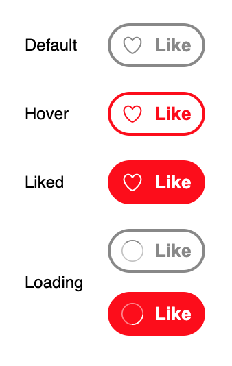

# Assignments

Source: https://app.notion.com/p/2f31199ccfe38050b5d0e9013e975a2d

## Theory Questions

| Company | Topic | Question |
| --- | --- | --- |
| Meta / Netflix | React Internals | Compare the internal implementation of the Stack Reconciler with the Fiber Reconciler. How does the Fiber “unit of work” enable interruptible rendering? |
| Amazon | JavaScript Inheritance | What is the difference between classical and prototypal inheritance? Explain how you would extend a built-in object like `Array`. |
| Flipkart | React Patterns | Demonstrate a Higher-Order Component (HOC) in React. |
| Microsoft | Reconciliation & Optimization | Explain the reconciliation process. How do `React.memo` and `useCallback` help maintain referential equality across renders? |
| Google / Amazon | JavaScript Internals | Implement a function that replicates the behavior of the `instanceof` operator by manually traversing the prototype chain. |
| Adobe | React Effects | Explain the difference between `useEffect` and `useLayoutEffect`. In what scenario would synchronous layout measurement be critical? |
| Zeta / Swiggy | React Diffing | Explain how React’s diffing algorithm handles elements of different types versus the same type with different attributes. |

## Coding Problems

| Company | Problem Area | Question | Duration |
| --- | --- | --- | --- |
| Uber | Real-time UI | Build a live-stream chat UI that receives messages at a high frequency and renders them efficiently while avoiding unnecessary re-renders.  Since there is **no real backend provided**, you may **simulate incoming messages locally** using:`setInterval` / `setTimeout`a mock WebSocket-like abstractionor any local message emitterMessages should arrive **frequently** (e.g., every 100–300ms).  Explain why `useRef` is used instead of state in certain places and how this improves performance.  **Basic UI Requirements (Keep It Simple)**The UI should include:A **scrollable chat container**Messages displayed in a **vertical list**New messages appended at the **bottom**Automatic scroll to the latest messageA simple message format (e.g., timestamp + text)No advanced styling is required.  **Performance Expectations 1. **Avoid re-rendering the entire message list on every incoming message. 2. Clean up timers/subscriptions on unmount. 3. Ensure UI remains responsive under frequent updates. | 30-45 minutes |
| Swiggy | DOM Interaction | Build a React component with a bounded container (e.g., a `div`). Track the mouse position **only when the cursor is inside this container** and render a small circle that follows the cursor. Use `useRef` to store mouse coordinates so updates do **not trigger unnecessary re-renders** on every mouse move.   The circle should stop moving when the cursor leaves the container. Focus on correct event handling and performance. | 30-45 minutes |
| Airbnb | Custom Hooks | 1. Create a reusable custom hook called `useFetch` that fetches data from a given URL and returns `{ data, loading, error }`.   2. Implement an **in-memory caching mechanism** such that:If the same URL is requested again **within 2 minutes**, the hook should **return cached data instead of making a new API call**.  3. If the cache has expired (older than 2 minutes), a **fresh network request should be made** and the cache updated.  4. The cache should be **shared across multiple components** using the hook, not reset on every re-render. | 30-45 minutes |
| PhonePe | State Management | Implement a multi-step form using React’s `useReducer` hook. The form should contain **multiple steps (e.g., Step 1, Step 2, Step 3)**, where each step collects a subset of form fields. Manage form state, navigation between steps, and validation logic using a **single reducer** instead of multiple `useState` calls.  The reducer should handle: **Form data updates** (field-level changes) **Step navigation** (Next / Previous) **Validation per stepError state management Final submission readiness** | 30-45 minutes |
| **Google/Amazon** | Custom Hook | Design a custom React hook called `useWindowSize` that tracks the browser window’s width and height and updates these values when the window is resized. The hook should handle event subscription and cleanup correctly and avoid causing unnecessary re-renders in components that consume it.  The hook should:Return the current window dimensions: `{ width, height } `Listen to the browser’s `resize` eventUpdate values only when the window size actually changesClean up event listeners when the component using the hook unmounts  **Performance Expectations (Very Important) **Window resize events can fire **many times per second**.  Therefore, the hook should:Avoid unnecessary state updatesAvoid triggering re-renders when dimensions haven’t changedUse refs where appropriate to store mutable values without re-rendering.  FYI: No external libraries can be used.  | 30-45 minutes |
| Not tagged to any company | General Machine coding | Build a simple mortgage calculator widget that takes in a loan amount, interest rate, loan term, and calculates the monthly mortgage payment, total payment amount, and total interest paid.   RequirementsThe user should be able to enter:  1. Loan amount ($) 2. Annual interest rate (%). This is also known as the annual percentage rate (APR) 3. Loan term (in years)  Using the inputs, the calculator should compute the following and display the results to the user:  1. Monthly mortgage payment 2. Total payment amount 3. Total interest paid  If a non-numerical string is entered into any input field, the calculator should display an error message. Additionally, the calculator should handle any other invalid inputs that may arise.  Round the result amounts to 2 decimal places.(The last two requirements might not be given to you during interviews, you're expected to clarify.  The formula for calculating the monthly payment is:  M = P(i(1+i)n)/((1+i)n - 1)  M: Monthly mortgage payment P: Loan amounti: Monthly interest rate (APR / 12) n: Total number of payments (loan term in years x 12)   | 30 minutes |
| Not tagged to any company | General Machine coding | Create a Like button which appearance changes based on the following states:  The heart and spinner icons are provided for your convenience. The focus of this question is on the handling of the various states, not so much on being pixel perfect. As for colors, you can use **`#f00`** for the red and **`#888`** for the gray.  **Requirements**In the button's default state, when it is clicked, it goes into the loading state and a request is made to the provided back end API which has a 50% chance of succeeding/failing.  (Use public API’s to simulate the post API behaviour or use the setTimeout to simulate it)  **Success response**: If the request was successful, the button changes to the "Liked" state.  **Failure response**: Otherwise it returns to the "Default"/"Hovered" state depending on whether the cursor is still over the button. The error message from the back end API should be shown below the button.If the user clicks on a button in the "Liked" state, the reverse happens.    | 30 minutes |

